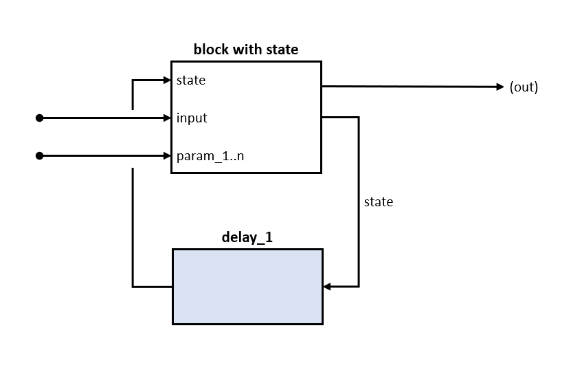
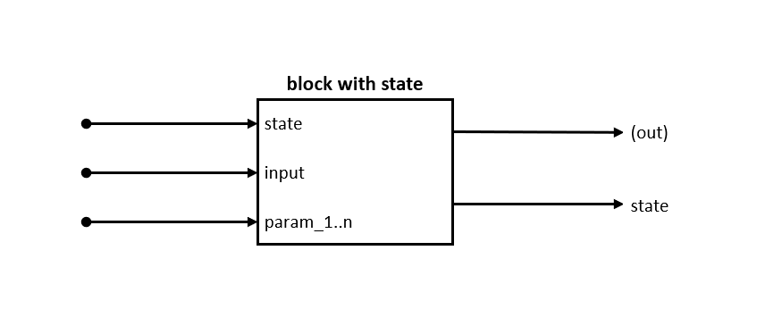

## Writing Stateful Functions

First, let's look again at the block diagram that defines a stateful function:



Notice that the feedback of state is the key point: how can that be achieved? To find an answer, let's just ignore it for a moment. We assume that there will be something that can handle this issue for us. What remains is a function with "state in" and "state out" beside the actual input and output values:



Assuming that some mechanism passes in previous state and records output state (that gets passed in as the previous state at the next evaluation, and so on), we can rewrite the object-oriented low pass filter code by transforming it to a pure function:

```fsharp
// float -> float -> float -> float * float
let lowPass timeConstant (input: float) =
    fun lastOut ->
        let diff = lastOut - input
        let out = lastOut - diff * timeConstant
        // the output state **is in this case** equals the output value
        let newState = out
        (newState,out)
```

What have we done?

* There is no mutable state anymore, since the previous state gets passed in as a function parameter. Benefit: we do not need a `lowPassCtor` function anymore.

* After application of the timeConstant parameter _and_ the actual input value, the remaining function has the signature ```float -> float * float```: the previous state comes in, resulting in a tuple that "packs" output state and an actual output value together.
  
<hint>

You have probably seen that we curried the most inner function "by hand." Instead, we could have written one single function like ```let lowPass timeConstant (input: float) lastOut = ...```. Since will will "name" those inner output functions, we will stick with the manual curried version.

</hint>

### Abstracting Instanciation

Like stateless functions, we want to compose many stateful functions to build higher-level computations. Since we not only want to compose functions that work like a low pass filter (with float as state), we generalize the function, so that in the end, we are looking for a way to compose functions that look like this:

``` 'state -> 'state * float ``` (instead of ```float -> float * float```).

Since ``` 'state * float ``` tuple is a significant thing that we will need more often, let's transform it to a named record type:

```fsharp
type BlockOutput<'state> = { value: float; state: 'state }
```

Then the signature of our stateful functions looks like this:
``` 'state -> BlockOutput<'state> ```

Let's name that function, too:

```fsharp
type Block<'state> = Block of ('state -> BlockOutput<'state>)
```

The `Block` type is a so-called **single case discriminated union**. I suggest you read [this](https://fsharpforfunandprofit.com/posts/designing-with-types-single-case-dus/) to understand how to construct and deconstruct unions, but you can try to figure it out by looking at the modified low pass filter code.

Compared to type abbreviations, single case unions have the advantage that it has to be constructed and deconstructed before the inner value (in our case, the stateful function) can be used. It is an advantage because it's not possible to pass or use a function "by accident" that has the same signature, but different semantics. It can also saves us from writing more type annotations.

The lowPass and fadeIn functions look like this (the resulting functions are simply passed to the `Block` constructor):

```fsharp
let lowPass timeConstant input =
    Block <| fun lastOut ->
        let diff = lastOut - input
        let out = lastOut - diff * timeConstant
        let newState = out
        { value = out; state = newState }

let fadeIn stepSize input =
    Block <| fun lastValue ->
        let result = input * lastValue
        let newState = min (lastValue + stepSize) 1.0
        { value = result; state = newState }
```

To be able to use a previously constructed single case union, we need a function that "unpacks" the inner value:

```fsharp
let runB block = let (Block b) = block in b
```

We will see shortly how `runB` is used.

#### Generalizing Float

Since we might have signal values that are not always of type `float`, we can easily generalize the `float`, so that our types look like this:

```fsharp
type BlockOutput<'value, 'state> = { value: 'value; state: 'state }

type Block<'value, 'state> = 'state -> BlockOutput<'value, 'state>
```

The code for `lowPass` and `fadeIn` remain the same because the compiler infers `float`.

Now we need a way of composing those functions. The composition must handle the "recording" of the output state and feed it into the next evaluation's input, and this must be done for every block in the computation. This sounds like we are goint to moved the key issue (instance management) into the composition layer. This is true - and beneficial - because we can abstract ("outsource") a recurring aspect of our programming model so that the user does not have to handle it anymore in a concrete way.
